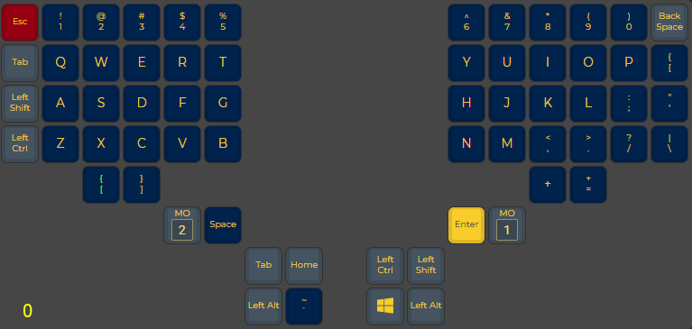
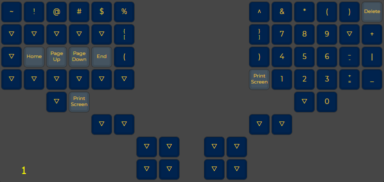
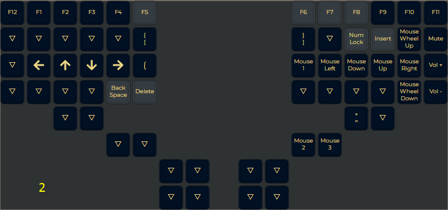

That's actually almost identical to the default one 😐

---

---

[`Slave half does't work` solution](https://www.reddit.com/r/olkb/comments/c0006h/comment/f5x74ax/?utm_source=share&utm_medium=web2x&context=3)
